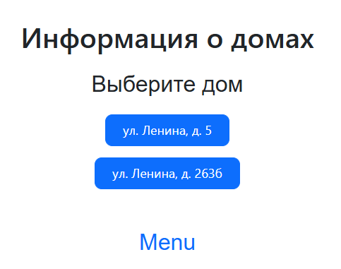
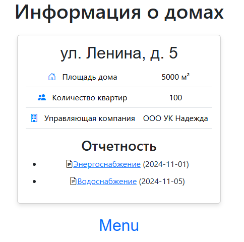

# Управляющая компания

Проект веб-приложения для отображения информации о домах и отчетности.

## Установка

1. Клонируйте репозиторий:
```bash
git clone https://github.com/ваш_логин/ваш_репозиторий.git
cd ваш_репозиторий
```
2. Установите зависимости:
```bash
npm install
```
3. Запустите сервер разработки:
```bash
npm start
```
## Используемые библиотеки

    axios: Работа с HTTP-запросами.
    bootstrap: Стилизация интерфейса.
    bootstrap-icons: Набор иконок.
    react: Библиотека для построения интерфейсов.
    react-bootstrap: Компоненты Bootstrap для React.
    react-dom: Работа с DOM в React.
    react-router-dom: Организация маршрутов.

### Как добавить зависимость

Если вы хотите добавить новую библиотеку, выполните команду:
```bash
npm install название_библиотеки

```
Эта команда обновит файл package.json и добавит новую зависимость.

## Как запустить проект
1. Убедитесь, что у вас установлен Node.js (рекомендуется версия 18).
2. Установите зависимости с помощью npm install.
3. Запустите backend из корневой папки: `node server.js`
4. Запустите frontend из папки frontend:
```bash
cd frontend
npm start
```
5. Проект доступен по адресу http://localhost:3000
## Скриншоты
### Меню (главная страница)

### Карточка дома

